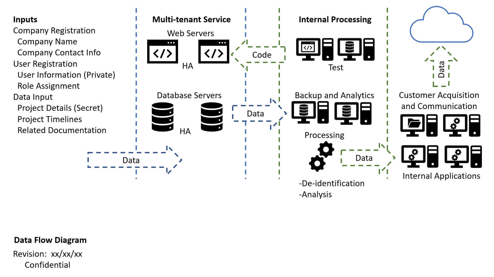

<!-- PROJECT SHIELDS -->
<!--
*** I'm using markdown "reference style" links for readability.
*** Reference links are enclosed in brackets [ ] instead of parentheses ( ).
*** See the bottom of this document for the declaration of the reference variables
*** for contributors-url, forks-url, etc. This is an optional, concise syntax you may use.
*** https://www.markdownguide.org/basic-syntax/#reference-style-links
-->

[![LinkedIn][linkedin-shield]][linkedin-url]

<!-- PROJECT LOGO -->
 

    

  <h3 align="center">SwiftTech Report</h3>

<!-- TABLE OF CONTENTS -->

  
Table of Contents

  <ol>
    <li>
      <a href="#about-the-project">About The Project</a>
    </li>
    <li><a href="#usage">Usage</a></li>
    <li><a href="#license">License</a></li>
    <li><a href="#contact">Contact</a></li>
  </ol>

<!-- ABOUT THE PROJECT -->
## About The Project

![cover]

* Project Name: SwiftTech Report
* Version: v1.0.0
* Organization Department: Technology

### Description

I identified potentially relevant compliance obligations, modified a risk 
management policy to meet the company SwiftTech specific needs.

I also assessed risks apparent in the company’s infrastructure leveraging 
common risk management frameworks, and developed governance activities to 
ensure security controls are operating as expected.

> This project was a milestone in my journey to study the Introduction 
to Cybersecurity Nanodegree provided by Udacity.

#### Project Overview

In this project, you will apply the skills you have acquired to analyze data 
provided about a fictional technology company and create fundamental components 
of the company’s GRC program.

In particular, you will identify potentially relevant compliance obligations, 
modify a risk management policy to meet the company’s specific needs, assess 
risks apparent in the company’s infrastructure leveraging common risk 
management frameworks, and develop governance activities to ensure security 
controls are operating as expected.

The following materials will be provided in order to complete the project:

A narrative describing the company, its business goals, and appetite for risk
Network and data flow diagrams
A partial cybersecurity risk management policy
A partial risk management framework.
The final implementation of these project components will showcase your 
ability to interpret business strategy as a function of risk management and 
develop primary GRC components to enhance the business’ security posture.

#### Welcome E-mail
Congratulations!

You have recently been hired by SwiftTech as a Cybersecurity GRC analyst! 
It’s a great opportunity for you and the timing couldn’t be better for SwiftTech. 
SwiftTech prides itself on being first-to-market with innovative technology 
solutions that improve work efficiency for companies around the globe. 
Part of SwiftTech’s success hinges on their ability to overcome obstacles 
and do everything in their power to develop new ideas as quickly as possible. 
Their latest product is a Software-as-a-Service (SaaS) solution that makes 
Project Tracking a breeze. The beta launch has already gotten amazing reviews 
and some analysts are saying that SwiftTech’s ProTrackPlus is a real contender 
to displace big name legacy Project Tracking software. In fact, SwiftTech has 
already lined up some potential large customers. A large healthcare system in 
the state of Minnesota has asked SwiftTech to participate in a Request for 
Proposal (RFP) process for new project management software. The government 
of the United Kingdom has also contacted SwiftTech about its software to 
replace project management software already being used by a number of 
government agencies.

SwiftTech does have a number of hurdles ahead. SwiftTech started off as a 
relatively small company. Their flagship product, GreenGrass – a contact 
management system, was designed and built to be installed on customer owned 
hardware in a physical location. ProTrackPlus is SwiftTech’s first foray into 
SaaS. SwiftTech wants to follow best practices as they relate to SaaS but 
they don’t want to sacrifice their commitment to agile software development 
and failing fast. SwiftTech’s motto is: Speed, Flexibility, Success! The major 
challenge for SwiftTech, however, is that they face a rapidly changing customer 
landscape that demands a higher level of vendor scrutiny. Prospective customers 
now expect new vendors to sign complex Master Service Agreements which dictate 
specific requirements for cybersecurity and governance, risk, and compliance 
programs. Many of the requirements are rooted in regulatory compliance or a 
potential customer’s appetite for risk. They also, at a minimum, expect SaaS 
vendors to provide a SOCII report which helps establish a baseline for 
cybersecurity controls and validates their effectiveness.

SwiftTech does not currently have a SOCII report but they recently hired an 
outside firm, Firehawk Security, to perform a readiness assessment in 
preparation for pursuing a SOCII attestation report. SwiftTech’s Chief 
Information Security Officer (CISO) has asked that you review Firehawk 
Security’s recommendations and follow through on several action items.

(<a href="#readme-top">back to top</a>)

<!-- USAGE EXAMPLES -->
## Usage

### Screenshots

(<a href="#readme-top">back to top</a>)

<!-- LICENSE -->
## License

Distributed under the MIT License. See `LICENSE.txt` for more information.

(<a href="#readme-top">back to top</a>)

<!-- CONTACT -->
## Contact

Mohamed AbdelGawad Ibrahim - [@m-abdelgawad](https://www.linkedin.com/in/m-abdelgawad/) - +201069052620 - muhammadabdelgawwad@gmail.com

GitHub Profile Link: [https://github.com/m-abdelgawad](https://github.com/m-abdelgawad)

(<a href="#readme-top">back to top</a>)

<!-- MARKDOWN LINKS & IMAGES -->
<!-- https://www.markdownguide.org/basic-syntax/#reference-style-links -->
[linkedin-shield]: https://img.shields.io/badge/-LinkedIn-black.svg?style=for-the-badge&logo=linkedin&colorB=555
[linkedin-url]: https://www.linkedin.com/in/m-abdelgawad/
[cover]: images/cover.jpg
